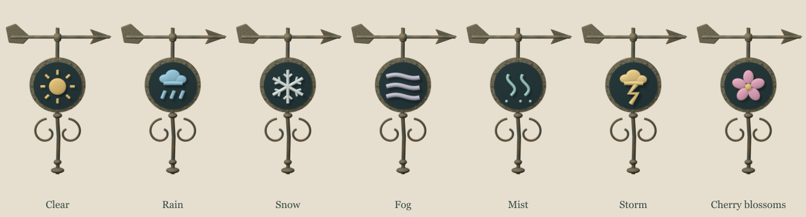
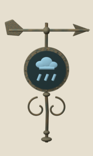

# Blender effects: cave water and magical weather vane

For the caves, Blender supplies **water only**. The hand-drawn stone columns, cave
pools and crystals remain the original images. The weather vane is a new Blender-made
object, mounted above the existing village shop without changing its artwork.

## Current experiment

Stone columns have a small drip falling from a painted ledge to the base. Cave
pools have an occasional drop arriving from above, with a tiny splash and ripple.
The 24-frame sequence plays at 12 fps, followed by a quiet interval. Each map/anchor
has a deterministic phase and interval (roughly 7–9 seconds between drops), so
movement and re-rendering do not restart every drop together. Lava has no water effect.

`utils/pixi/CaveDrips.ts` attaches the water to the existing Pixi sprites. It uses
their size, depth and visibility, stops displaying water for reduced-motion users,
and clears its sprites and frame views on map changes. The atlas belongs to the
normal map texture residency system, not the always-loaded core set. The legacy
DOM sprite renderer does not show this experimental effect.

The runtime atlas is 1024×768 RGBA (about 3 MiB decoded before mipmaps), shared by
all drops. It is already rendered at its intended resolution and must **not** be
passed through the general tile/GIF resizer. `assets.ts` registers its source path.

## Edit or reproduce

Open `design_docs/blender/cave-drip.blend` in Blender. It contains the animated
water bead, two impact rings, three tiny splash droplets, camera and light; no
painted game assets. The saved scene uses an orthographic camera and transparent film.

To reproduce with Blender 5.2:

```sh
/Applications/Blender.app/Contents/MacOS/Blender --background --python-exit-code 1 --python scripts/blender/cave_drip.py -- --out /tmp/twilight-cave-drip
node scripts/blender/pack-cave-drip.mjs /tmp/twilight-cave-drip
make verify
```

The packer writes the runtime atlas and copies the editable scene into the repository.
Adjust placement, opacity and timing in `data/caveDrips.ts`. Its placement coordinates
are fractions of the painted sprite's full square canvas, including transparent padding.
Keep that padding intact when editing art or the attachments will shift.

## Collision correction

Stone column and mine crystal collision now occupies a shallow ground footprint
near the painted base, leaving room for the player to walk behind their upright
silhouettes. The player's own 0.8-tile collision width still contributes to clearance.
Cave pool bounds have a smaller inset rectangle to ease movement around their edges.
Visual sprite dimensions are unchanged. The renderer's existing depth sorting reads
the corrected footprint, so it also sorts players at the ground contact line.

Check all three sizes in a cave: walk behind columns and crystals, approach their
bases from the front, skirt pools, move the camera, then leave and re-enter. Water
should remain subtle and should never prevent movement. The movement regression
test exercises the real collision hook against all six solid formation sizes.

## Magical weather vane

Look above the **village shop roof**. Its fixed enamel dial shows the current weather,
while its copper arrow turns through 16 Blender-rendered views. The symbol stays
readable even when the arrow is edge-on. It reports the real weather state passed to
the scenery renderer, including weather changes caused by magic; it does not forecast
or control weather and its arrow is not a compass.

| Weather | Sign |
| --- | --- |
| Clear | Golden sun |
| Rain | Blue cloud and drops |
| Snow | Ivory snowflake |
| Fog | Three low horizontal bands |
| Mist | Two rising wisps with droplets |
| Storm | Amber cloud and lightning |
| Cherry blossoms | Pink five-petalled flower |

The arrow moves gently in calm weather and responds more strongly during storms.
Reduced-motion mode holds the arrow still but continues updating the weather sign.
Only the village shop gets this attachment. It inherits the building's depth and
visibility; it adds no collision or interaction area. The legacy DOM renderer does
not show the vane.

`data/weatherVane.ts` defines the seven signs, movement and placement;
`utils/pixi/WeatherVane.ts` renders them. Three textures (base, rotor atlas, sign atlas)
cost about 5.6 MiB before mipmaps and are resident only for the village. They are
already at game resolution and bypass the generic image resizer.





To reproduce the editable Blender scene, runtime images and review previews:

```sh
/Applications/Blender.app/Contents/MacOS/Blender --background --python-exit-code 1 --python scripts/blender/weather_vane.py -- --out /tmp/twilight-weather-vane
node scripts/blender/pack-weather-vane.mjs /tmp/twilight-weather-vane
make verify
```

Open `design_docs/blender/weather-vane.blend` to edit the model. Weather symbols are
separate named objects; the saved scene shows the clear sign. The renderer combines
the fixed body, moving arrow and selected sign without replacing any existing art.

For a manual check, stand near the shop and use F4 to cycle through all seven weather
states. Watch the dial update, test reduced motion, walk until the shop leaves view,
then leave the village and return. The vane should remain on the roof in all seasons.
