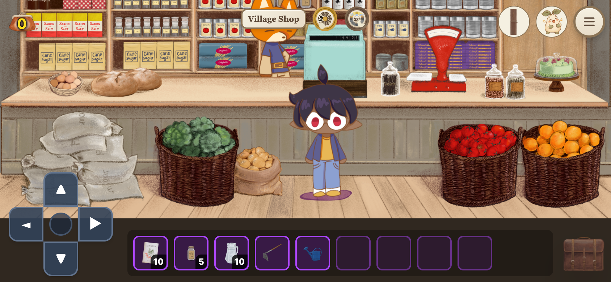
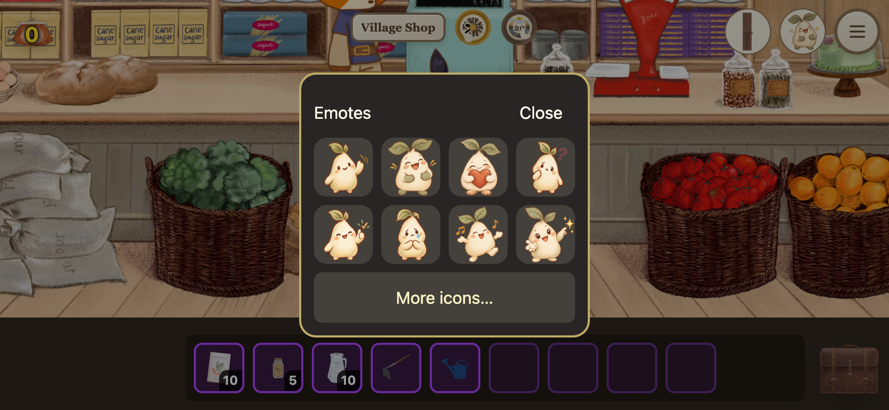
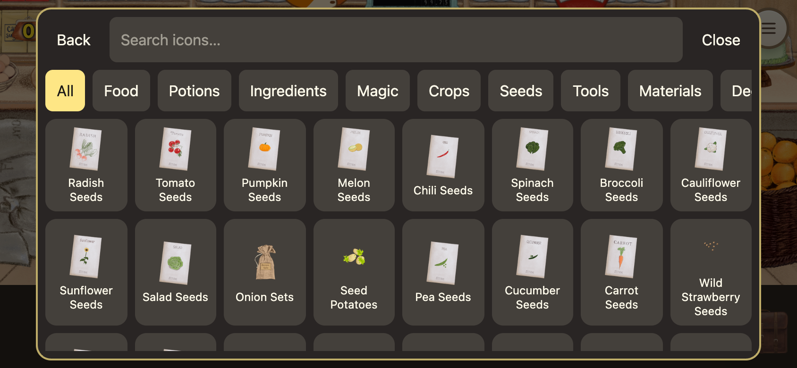

# Mobile recovery and compact HUD review

Mobile defaults now use 50% outdoors and Fit in the two pilot interiors (Mum’s kitchen and the shop). Existing explicit camera choices are retained during the session. Pinch claims canvas gestures, cancels interrupted gestures, and Settings provides small zoom steps alongside Fit.

Mobile entry and Unstick player seek terrain that is also clear of NPC collision radii. Transition callers save the actual adjusted position. Unstick is directly available in the menu header.

The mobile HUD uses existing book/emote artwork, a menu icon, a smaller satchel and a single location row. Account remains in the menu. Emotes and the existing game-icon catalogue are reachable from the HUD and menu. Settings displays the build version and a user-triggered Save & reload action. An already-open installed app can still be running an older build; reload requires connectivity to obtain a new shell.

Sentry issue JAVASCRIPT-REACT-G identified memory accounting reading a destroyed texture source. TextureManager now tolerates destroyed sources, protects shared sources still in use, avoids double disposal, and waits for asset unloading before reloading. This is a shared correctness fix. It does not establish that every iOS process termination is resolved. The sampled iPhone event used release d54612b, older than deployed 62e3b6c; attribution to the reporting player is unconfirmed.

Validation: make verify (1,345 tests, 164 files), lint (zero errors, seven existing warnings), Vite production build. Chromium touch emulation at 844×390 verified Fit, incremental zoom, browser-dispatched pinch (58.6% to 70.3%), Unstick, and both emote menus with no page errors in the pinch/menu run. Physical iPhone Firefox and installed-web-app crash endurance still require testing after deployment.

